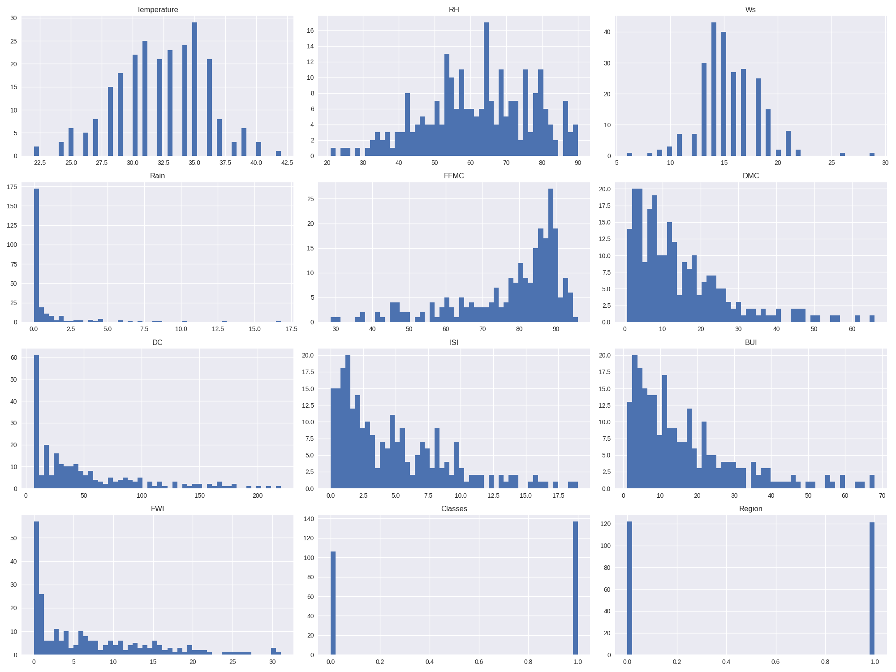
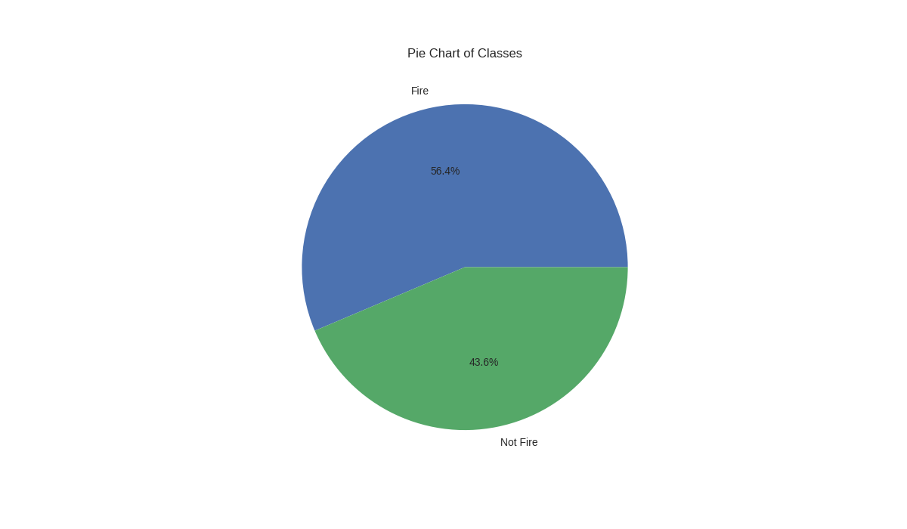
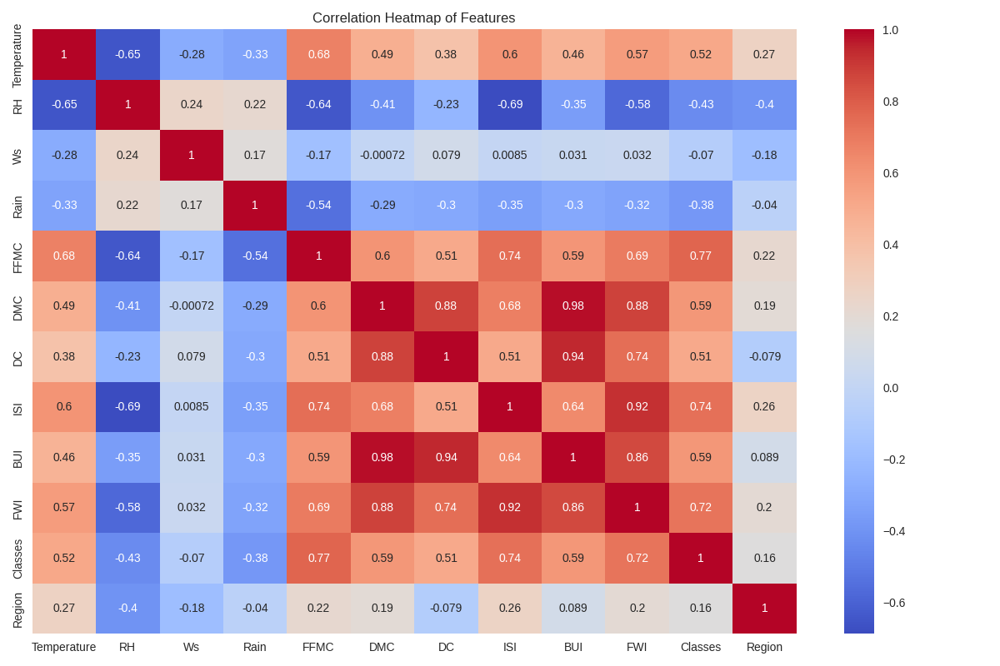
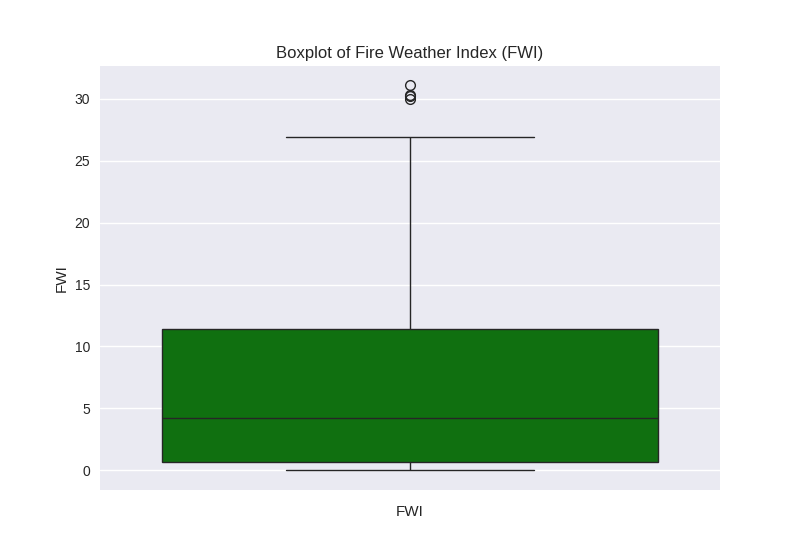
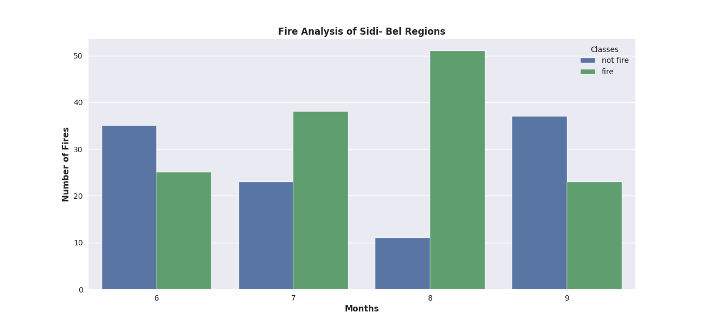
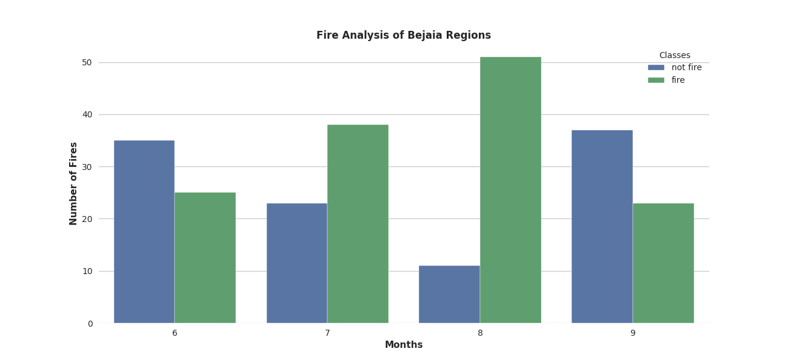
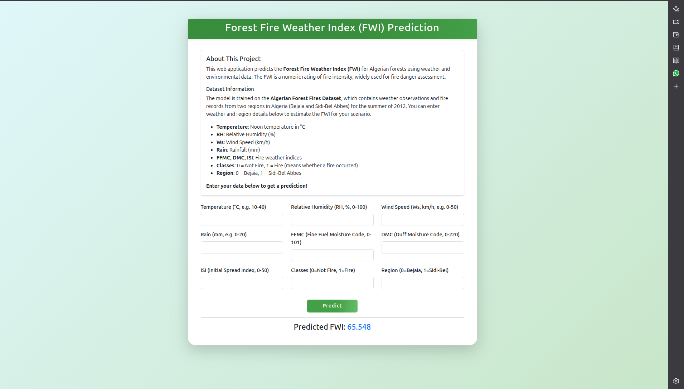

# Forest Fire Weather Index (FWI) Prediction Web App

A Flask web application that predicts the Forest Fire Weather Index (FWI) for Algerian forests using weather and environmental data. The app is powered by a Ridge Regression model trained on the Algerian Forest Fires Dataset (2012). Users can input weather details to estimate fire risk instantly.

---

## 📊 Dataset

- **Source:** Algerian Forest Fires Dataset (2012)
- **Records:** 244 instances (122 each from Bejaia and Sidi-Bel Abbes regions)
- **Features:** Weather observations (Temperature, RH, Wind Speed, Rain, etc.), FWI components, Region, and Fire occurrence (Classes)
- **Target:** Fire Weather Index (FWI)

---

## 🚀 Project Workflow

1. **Data Cleaning & Preprocessing**
   - Removed missing values and fixed column names.
   - Encoded categorical variables (e.g., Classes: 0 = Not Fire, 1 = Fire).
   - Added region codes (0 = Bejaia, 1 = Sidi-Bel Abbes).

2. **Feature Engineering**
   - Dropped unnecessary columns (day, month, year).
   - Checked and removed highly correlated features to reduce multicollinearity.
   - Standardized features using `StandardScaler`.

3. **Model Training & Evaluation**
   - Trained and compared several regression models:
     - Linear Regression
     - Lasso Regression (with/without cross-validation)
     - Ridge Regression (with/without cross-validation)
     - ElasticNet Regression (with/without cross-validation)
   - Evaluated using Mean Absolute Error (MAE) and R² Score.

4. **Model Selection**
   - Ridge Regression and ElasticNet performed best and were saved for deployment.

5. **Web App Deployment**
   - Built a Flask web app for real-time FWI prediction.

---

## 📈 Model Comparison

| Model           | MAE      | R² Score  |
|-----------------|----------|-----------|
| Linear Regression | 0.5468   | 0.9848    |
| Lasso             | 1.1332   | 0.9492    |
| LassoCV           | 0.6200   | 0.9821    |
| Ridge             | 0.5642   | 0.9843    |
| RidgeCV           | 0.5642   | 0.9843    |
| ElasticNet        | 1.8822   | 0.8753    |
| ElasticNetCV      | 0.6576   | 0.9814    |


---

## 📊 Results & Visualizations

### 1. Feature Distributions



*Takeaway:*  
Most features are well distributed, but some (like Rain) are heavily skewed. This helps understand the data spread and potential outliers.

---

### 2. Class Distribution



*Takeaway:*  
There are more "fire" instances than "not fire" in the dataset, indicating a slight class imbalance (about 57% fire, 43% not fire).

---

### 3. Correlation Heatmap



*Takeaway:*  
Some features are highly correlated (e.g., FWI components), which was addressed by removing highly correlated features to reduce multicollinearity.

---

### 4. FWI Boxplot



*Takeaway:*  
FWI values are mostly concentrated at lower values, with a few high outliers, indicating that extreme fire risk days are rare.

---

### 5. Monthly Fire Analysis - Sidi-Bel Abbes Region



*Takeaway:*  
Most fires in Sidi-Bel Abbes occurred in August and July, with very few in June and September.

---

### 6. Monthly Fire Analysis - Bejaia Region



*Takeaway:*  
Bejaia also saw most fires in August, with a similar seasonal pattern as Sidi-Bel Abbes.

---

## 🌐 Web App

The interactive web application allows users to easily predict the Forest Fire Weather Index (FWI) for Algerian forests:

- **User-Friendly Form:** Enter weather and region details such as temperature, humidity, wind speed, rainfall, fire indices, and region code.
- **Instant Prediction:** Click "Predict" to instantly receive the estimated FWI for your scenario.
- **Clear Guidance:** The form includes helpful descriptions and example values for each field, making it accessible for all users.
- **Risk Assessment:** The predicted FWI helps assess fire risk and supports preventive planning.



---

## 🛠️ How to Run

1. Clone the repo and install requirements:
    ```bash
    pip install -r requirements.txt
    ```
2. Run the Flask app:
    ```bash
    python application.py
    ```
3. Open your browser at [http://localhost:5000](http://localhost:5000) + /predictdata at the end of your URL

---

## 📚 References

- [Algerian Forest Fires Dataset - UCI ML Repository](https://archive.ics.uci.edu/ml/datasets/Algerian+Forest+Fires+Dataset+)
- [FWI System - Wikipedia](https://en.wikipedia.org/wiki/Canadian_Forest_Fire_Weather_Index_System)

---

## ✍️ Author

- [Your Name](https://github.com/HarshStats)

---
